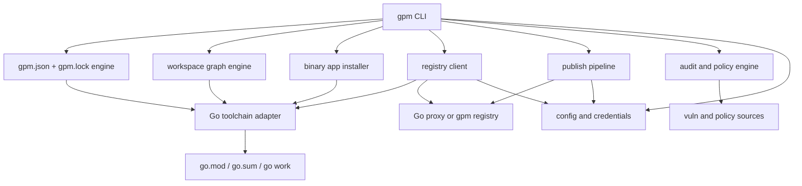

# gpm Product and Architecture Spec

Status: Draft 0.1
Date: 2026-05-02

## 1. Summary

`gpm` is an npm-style package, workspace, and publishing tool for Go, written entirely in Go.

The core premise is deliberately narrow:

- Keep `go.mod` and `go.sum` as the canonical dependency graph.
- Keep the Go compiler, linker, formatter, and test runner as the canonical build toolchain.
- Add the missing product layer that Go developers routinely rebuild ad hoc: scripts, workspaces, publishing UX, registry auth, monorepo ergonomics, tool dependencies, binary app installation, and policy surfaces.

`gpm` is not a replacement for the Go toolchain. It is a product layer over the Go module ecosystem that aims to make common developer workflows feel as cohesive as `npm` while remaining native to Go.

## 2. Problem Statement

Go's dependency and build story is solid at the language and toolchain level, but the developer experience is fragmented at the product level.

Today, Go developers often combine:

- `go mod` for dependency resolution
- `go work` for local multi-module development
- `make`, shell scripts, or Taskfiles for automation
- hand-managed environment variables for private registries
- ad hoc release scripts for publishing
- custom tools for license, vulnerability, or policy enforcement

This is powerful but uneven. Teams regularly end up rebuilding a thin package manager around the official tools because the official tools are intentionally lower level than the workflows they need.

`gpm` exists to unify these higher-level workflows into a single, Go-native, installable binary.

## 3. Product Thesis

If `npm` succeeded because it made "package + script + publish + workspace" feel like one coherent thing, `gpm` should do the same for Go without fighting the language's existing module model.

The right product is not "npm but for source imports."

The right product is:

- npm-like command ergonomics
- Go-native dependency truth
- first-class workspaces
- first-class private registry support
- first-class task running
- first-class package publishing and policy tooling

## 4. Goals

`gpm` should:

1. Make common Go package workflows feel simple and discoverable.
2. Provide a single CLI for package, workspace, script, registry, and publish flows.
3. Support monorepos and multi-module repositories as first-class citizens.
4. Provide a friendly metadata layer analogous to `package.json`, without replacing `go.mod`.
5. Make private registry configuration and authentication sane.
6. Support installation of Go binary apps at user and system scopes.
7. Support reproducible installs and CI-friendly lock semantics.
8. Provide built-in security, audit, and policy surfaces.
9. Be implemented entirely in Go as a single binary.

## 5. Non-Goals

`gpm` will not:

1. Replace `go build`, `go test`, `go fmt`, or the compiler toolchain.
2. Replace `go.mod` as the source of truth for module requirements.
3. Invent a second dependency solver with incompatible semantics.
4. Require users to abandon import-path-based module identity.
5. Copy npm lifecycle hooks blindly, especially where they expand the attack surface.
6. Depend on Node, Python, or a shell runtime for core behavior.
7. Attempt to hide the Go toolchain so thoroughly that debugging becomes harder.

## 6. Core Design Principles

### 6.1 Canonical State Lives in Go Files

`go.mod` and `go.sum` remain canonical for dependency resolution.

`gpm` may add a higher-level manifest for scripts, registry configuration, workspace metadata, and publish settings, but it must never silently fork dependency truth away from what the `go` tool understands.

### 6.2 Thin Product Layer, Not Parallel Language Infrastructure

When possible, `gpm` should orchestrate the official Go toolchain rather than emulate it.

### 6.3 Great UX Beats Clever Semantics

The product should be easier to understand than the stack developers already have today.

### 6.4 Safe by Default

Lifecycle hooks, fetched executables, credential handling, and audit behavior should all be designed with a more conservative threat model than npm historically had.

### 6.5 Single-Binary Distribution

The installation story should be one static Go binary wherever feasible.

## 7. User Personas

### 7.1 Solo Go Developer

Wants:

- fast onboarding
- easy dependency add/remove flows
- a scripts surface
- clean publishing for a module or CLI tool
- easy installation of Go CLI apps

### 7.2 Monorepo Team

Wants:

- workspace-aware installs
- shared scripts
- local package linking
- reliable CI behavior

### 7.3 Platform or Infra Team

Wants:

- private registry auth
- mirrored dependencies
- audit and policy enforcement
- reproducible builds

### 7.4 Tooling Author

Wants:

- easy management of code generators and dev tools
- package metadata beyond what `go.mod` currently expresses
- predictable installation of pinned CLI tools

## 8. User Experience Goals

The CLI should feel familiar to developers who know `npm`, while still feeling honest about Go's actual model.

Examples:

```text
gpm init
gpm add github.com/stretchr/testify
gpm remove github.com/stretchr/testify
gpm install
gpm run test
gpm run lint
gpm app install github.com/charmbracelet/glow@latest
gpm workspace list
gpm publish
gpm audit
gpm login
```

The CLI should be:

- discoverable
- explicit
- scriptable
- easy to explain to new contributors

## 9. Data Model

`gpm` introduces a new manifest: `gpm.json`.

`gpm.json` is not a dependency authority. It is a product manifest.

### 9.1 Proposed `gpm.json` Shape

```json
{
  "name": "github.com/acme/payments",
  "version": "0.4.0",
  "private": false,
  "description": "Payments service and shared tooling",
  "license": "MIT",
  "repository": {
    "type": "git",
    "url": "https://github.com/acme/payments.git"
  },
  "scripts": {
    "build": "go build ./...",
    "test": "go test ./...",
    "lint": "golangci-lint run",
    "generate": "go generate ./..."
  },
  "workspaces": [
    "./services/api",
    "./libs/auth"
  ],
  "publish": {
    "registry": "acme",
    "visibility": "private"
  },
  "registries": {
    "acme": {
      "url": "https://gpm.acme.internal",
      "scope": "github.com/acme"
    }
  },
  "tools": {
    "golangci-lint": {
      "module": "github.com/golangci/golangci-lint/cmd/golangci-lint",
      "version": "v1.64.8"
    }
  }
}
```

### 9.2 Manifest Responsibilities

`gpm.json` is responsible for:

- scripts
- workspace metadata
- package identity metadata not modeled well by `go.mod`
- registry aliases and publish defaults
- tool dependency declarations
- policy configuration

`gpm.json` is not responsible for:

- authoritative module dependency requirements
- compiler flags that belong in direct toolchain invocations
- import graph semantics

## 10. Package Model

The package identity model must remain compatible with Go module identity.

That means:

- packages are still modules
- module paths remain import paths
- semver tagging remains compatible with Go module expectations
- major version suffix rules remain intact

`gpm` may provide friendlier commands around these rules, but it should not hide or redefine them.

## 11. Dependency Management

### 11.1 Add

`gpm add <module>` should:

1. update `go.mod` using the Go toolchain
2. reconcile the `gpm` lock state
3. optionally record intent in `gpm.json` when useful for top-level package metadata or tooling

### 11.2 Remove

`gpm remove <module>` should:

1. remove direct usage where possible
2. update `go.mod`
3. run the equivalent of a dependency tidy flow
4. update lock state

### 11.3 Install

`gpm install` should mean:

- reconcile the local environment to the dependency and workspace state
- fetch missing modules through configured registries or proxies
- install declared tool dependencies where applicable
- produce deterministic lock output

Because Go already resolves source dependencies through modules, `gpm install` is less about building a `node_modules` tree and more about:

- dependency hydration
- tool bootstrap
- workspace consistency
- lock verification

## 12. Lockfile Strategy

Go already has `go.sum`, but `go.sum` is not a full product-level lock manifest in the npm sense.

`gpm` should introduce a separate lockfile, tentatively `gpm.lock`, to capture:

- workspace package graph
- resolved registry sources
- tool dependency resolutions
- publish-time metadata pins where relevant
- policy and integrity metadata beyond `go.sum`

Rules:

- `go.sum` remains canonical for module checksums that the Go toolchain consumes.
- `gpm.lock` captures the higher-level package manager view.
- `gpm` must fail loudly if `gpm.lock` and the actual Go module state diverge.

The current implementation direction is:

- `gpm add`, `gpm remove`, `gpm install`, and `gpm update` write `gpm.lock`
- the initial lockfile captures resolved `go.mod` requirements and declared tool targets
- richer registry source metadata and strict divergence enforcement remain future Phase 1 work

## 13. Scripts

Scripts are one of the main reasons this product exists.

`gpm run <name>` should:

- run scripts declared in `gpm.json`
- expose a stable execution environment
- support workspace-targeted execution
- provide good output formatting
- support argument passthrough

Examples:

```text
gpm run test
gpm run lint -- --fix
gpm run build --workspace ./services/api
```

The scripts system should avoid shell-specific behavior when possible. Long term, `gpm` may support structured script declarations in addition to raw shell commands.

## 14. Workspaces

Workspaces are a first-class feature, not an afterthought.

`gpm` should improve the experience of `go work` by adding:

- workspace discovery
- workspace script execution
- local package linking validation
- filtered execution by package or tag
- unified install and audit behavior across modules

`gpm` should use `go work` compatibility where possible rather than inventing a wholly separate local linking model.

### 14.1 Workspace Commands

```text
gpm workspace list
gpm workspace sync
gpm workspace run test
gpm workspace add ./libs/auth
```

## 15. Registry Model

This is the hardest product area and must be phased carefully.

There are two viable roles for `gpm`:

1. CLI-only package manager that configures and talks to existing Go proxies and internal registries.
2. End-to-end ecosystem with both CLI and a `gpm` registry/proxy service.

The spec should support both, but v0 should prioritize the CLI.

### 15.1 Registry Responsibilities

A registry integration may provide:

- module proxying
- module publishing
- authentication
- organization policy
- vulnerability and license metadata
- package search and discovery

### 15.2 Compatibility Constraints

To succeed in real Go environments, `gpm` must respect:

- `GOPROXY`
- `GONOSUMDB`
- `GOPRIVATE`
- checksum verification behavior
- VCS-backed module fetching

### 15.3 Recommended Path

Phase 1 should treat registries as configured upstreams and add a better UX around them.

Phase 2 may introduce a `gpm` registry service that speaks the Go proxy protocol and adds higher-level package metadata APIs.

When that service exists, the registry/index model should follow a strict separation of concerns:

- proxy-compatible module artifacts are canonical for fetchable module payloads
- package/version metadata is canonical for higher-level `gpm` registry state
- search and discovery indexes are derived data and must be rebuildable

Direct installation and resolution must not depend on the search index being available.

See [docs/registry-index-design.md](registry-index-design.md) for the concrete design direction.

## 16. Publishing

`gpm publish` should provide a higher-level publishing flow than raw Git tag choreography without breaking Go's expectations.

Publishing responsibilities may include:

- version validation
- working tree checks
- changelog or release note hooks
- semver/tag enforcement
- registry upload or mirror notification
- metadata publication for search and discovery

The publishing system should support:

- public modules
- private internal modules
- CLI tool packages
- monorepo workspace packages

`gpm publish` should be able to run in a dry-run mode.

## 17. Tool Dependencies

Go teams often depend on code generators, linters, mock generators, and release tools that do not fit elegantly into application dependencies.

`gpm` should support a first-class `tools` section for:

- pinning tool modules
- installing tools into a managed location
- executing tool binaries consistently in scripts and CI

This gives teams a coherent alternative to scattered `tools.go` files, shell bootstraps, or manual installation docs.

The current implementation direction is:

- declare tools in `gpm.json`
- install them into a project-local managed bin directory
- make `gpm install` hydrate those binaries
- make `gpm run` and `gpm exec` use the managed bin directory automatically

## 18. Binary App Installation

`gpm` should treat Go binary app installation as a first-class workflow, separate from module dependency install.

This distinction matters:

- `gpm install` is for project dependency and environment reconciliation.
- `gpm app install` is for installing runnable binaries built from Go packages.

Examples:

```text
gpm app install github.com/charmbracelet/glow@latest
gpm app install github.com/air-verse/air@latest --scope user
gpm app install github.com/pressly/goose/v3/cmd/goose@latest --scope global
gpm app list
gpm app uninstall glow
```

### 18.1 Installation Scopes

The product should support at least two scopes:

- `user`: install into a user-owned binary directory
- `global`: install into a system-wide binary directory

A future `project` scope may also be useful for repo-local tool pinning, but the user and global scopes are the immediate requirement.

### 18.2 Implementation Strategy

The right implementation is almost certainly an orchestration layer over `go install`, with `gpm` adding:

- consistent target resolution
- scope-aware bin directory handling
- config and path discovery
- install receipts and list/uninstall flows
- registry and proxy compatibility
- eventual listing, upgrade, and uninstall flows

`gpm` should not invent a separate binary packaging format for this.

## 19. Security Model

This product should learn from npm's worst mistakes rather than inheriting them.

### 18.1 Default Security Posture

- no implicit remote code execution during dependency fetch
- no auto-running lifecycle hooks from downloaded packages
- explicit trust boundaries for scripts
- explicit credential storage behavior
- checksum and provenance verification wherever possible

### 18.2 Audit

`gpm audit` should aggregate:

- known vulnerabilities
- license issues
- policy violations
- workspace-wide findings

### 18.3 Credentials

`gpm login` should prefer:

- OS credential stores when available
- explicit token scoping
- clear per-registry configuration

## 20. CLI Surface

Initial command groups:

```text
gpm init
gpm add
gpm remove
gpm install
gpm update
gpm run
gpm exec
gpm app
gpm workspace
gpm publish
gpm login
gpm registry
gpm audit
gpm doctor
gpm config
```

### 19.1 Command Semantics

- `init`: create `gpm.json`, inspect existing `go.mod`, bootstrap scripts
- `add`: add a direct module or tool dependency
- `remove`: remove a direct dependency
- `install`: reconcile dependencies, tools, lock, and workspace state
- `update`: perform controlled upgrades
- `run`: execute named scripts
- `exec`: execute package-managed tools without global install friction
- `app`: install, list, and uninstall Go binary apps at user or global scope
- `workspace`: inspect and operate on multi-module trees
- `publish`: package and release a module
- `login`: authenticate to registries
- `registry`: manage registry configuration
- `audit`: scan for vulnerabilities and policy issues
- `doctor`: detect configuration drift and common setup failures
- `config`: inspect and mutate settings

## 21. Architecture

The system should be split into a small number of clear subsystems.

### 20.1 Major Components

1. CLI frontend
2. manifest and lockfile engine
3. Go toolchain adapter
4. workspace graph engine
5. binary app installer
6. registry client
7. publish pipeline
8. audit and policy engine
9. credential and config store

### 20.2 Architectural Diagram



### 20.3 Go Toolchain Adapter

This component is strategically important.

It should be responsible for:

- invoking `go mod`, `go list`, `go work`, and related commands
- parsing structured output where possible
- preventing the rest of the system from becoming shell-script glue

## 22. Configuration

Configuration should exist at three levels:

1. project-local
2. user-level
3. environment override

Likely files:

- `gpm.json`
- `gpm.lock`
- `~/.config/gpm/config.toml` or equivalent

Environment variables may override registry and auth behavior for CI.

## 23. Compatibility Strategy

`gpm` must be usable incrementally.

A team should be able to:

1. keep existing `go.mod` files
2. adopt `gpm.json` for scripts and metadata
3. adopt workspace and tool features later
4. adopt publishing and registry features last

This incremental path is important. If adoption requires repo-wide upheaval, the product will lose one of its biggest advantages.

## 24. Phased Delivery Plan

### Phase 0: Product Skeleton

- `gpm init`
- `gpm run`
- `gpm app install`
- `gpm doctor`
- manifest parsing
- config loading

Outcome:

- immediate value for scripts and repo bootstrap

### Phase 1: Dependency UX Layer

- `gpm add`
- `gpm remove`
- `gpm install`
- `gpm update`
- `gpm.lock`

Outcome:

- npm-like dependency workflows over official Go module behavior

### Phase 2: Workspace Power Tools

- workspace discovery
- workspace run
- workspace sync
- local linking validation

Outcome:

- monorepo story stronger than raw `go work`

### Phase 3: Registry and Publish

- `gpm login`
- `gpm registry`
- `gpm publish`
- registry-aware resolution UX

Outcome:

- viable internal platform tool

### Phase 4: Audit and Policy

- `gpm audit`
- license checks
- org policy
- provenance surfaces

Outcome:

- platform and enterprise value

## 25. MVP Recommendation

The recommended MVP is not "full npm parity."

The recommended MVP is:

1. `gpm init`
2. `gpm run`
3. `gpm app install`
4. `gpm add`
5. `gpm remove`
6. `gpm install`
7. `gpm doctor`

This gives `gpm` a believable developer loop without requiring us to solve registry infrastructure on day one.

## 26. Key Risks

### 26.1 Identity Confusion

If users are not sure whether `go.mod` or `gpm.json` owns dependency truth, the product fails.

### 26.2 Overreach

Trying to clone every npm feature literally will create a worse product than building the right Go-native subset.

### 26.3 Registry Complexity

Private registries, proxies, auth, checksums, and publishing semantics are deep waters.

### 26.4 Script Portability

If scripts are shell-fragile, the UX benefit collapses.

### 26.5 Install Scope Confusion

If user-scope, project-scope, and system-wide binary installs are not clearly separated, the product will feel unpredictable.

### 26.6 Toolchain Drift

If `gpm` relies on unstable parsing of human-oriented `go` output, it will become brittle.

## 27. Open Questions

1. Should `gpm` prefer JSON, TOML, or YAML for the manifest long term, even if the first draft uses JSON?
2. Should `gpm` eventually support both project-local and user-wide tool caches, even though the initial implementation is project-local?
3. What should the default user-scope binary directory be on each platform?
4. Should `gpm publish` require Git cleanliness by default?
5. How much of workspace state should be mirrored into `go work` versus managed purely in `gpm` metadata?
6. Should `gpm exec` support remote ephemeral tool execution, or only pinned installed tools?
7. Should the future registry service be bundled into this repo or split into a sibling project?

## 28. Recommended Next Step

Turn this spec into an implementation contract for Phase 0 and MVP.

Specifically:

1. freeze the manifest schema for `init` and `run`
2. define the exact CLI grammar for the first commands
3. define config and file lookup rules
4. scaffold the Go CLI around those contracts

That path keeps the project grounded while still preserving the larger vision.
